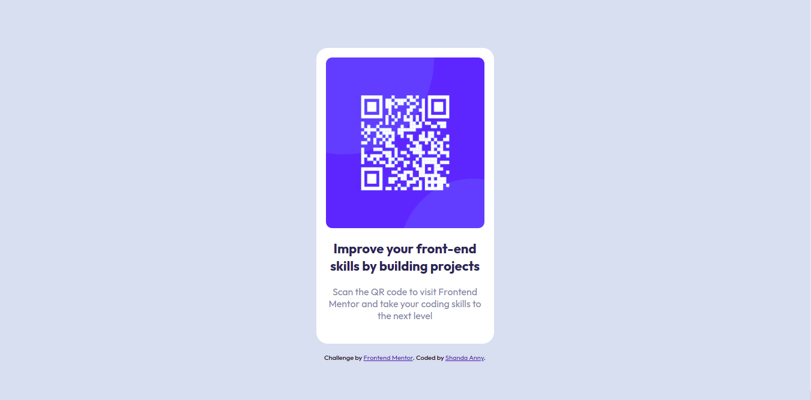
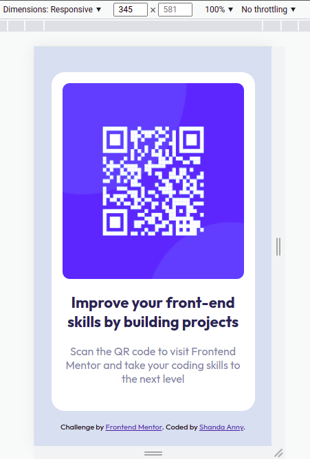

# Frontend Mentor - QR code component solution

This is a solution to the [QR code component challenge on Frontend Mentor](https://www.frontendmentor.io/challenges/qr-code-component-iux_sIO_H). Frontend Mentor challenges help you improve your coding skills by building realistic projects.

## Table of contents

- [Overview](#overview)
  - [Screenshot](#screenshot)
  - [Links](#links)
- [My process](#my-process)
  - [Built with](#built-with)
  - [What I learned](#what-i-learned)
  - [Continued development](#continued-development)
  - [Useful resources](#useful-resources)
- [Author](#author)
- [Acknowledgments](#acknowledgments)

**Note: Delete this note and update the table of contents based on what sections you keep.**

## Overview

### Screenshot




### Links

- Solution URL: [github-repository](https://github.com/shanda0409/qr-code-component-frontend-mentor-challenge-1.git)
- Live Site URL: [github-live-url](https://shanda0409.github.io/qr-code-component-frontend-mentor-challenge-1/)

## My process

### Built with

- HTML5 markup
- CSS custom properties
- CSS Flexbox

### What I learned

It's really a great feeling when I got satisfied with my code's output. Specially CSS properties. And frankly speaking it was really tough to match the output as provided display image. But I would mention the rem, px things in CSS. Moreover, I didn't use github to deploy my any projects. Honestly, this is so cool experience.

Here are a few lines which I really found useful for my future use in CSS. Please let me know if I can improve my knowledge here.

```css
.card {
  background-color: hsl(0, 0%, 100%);
  border-radius: 1.2rem;
  max-width: 16.5rem;
  padding: 1rem;
  margin-bottom: 1rem;
}

img {
  width: 100%;
  border-radius: 0.65rem;
  max-height: 18rem;
  max-width: 18rem;
}

h1 {
  margin-top: 1rem;
  margin-bottom: 0.9rem;
  font-size: 1.375rem;
  line-height: 1.8rem;
  font-weight: 700;
  font-stretch: extra-expanded;
  color: hsl(218, 44%, 22%);
  text-align: center;
}

p {
  font-size: 0.99rem;
  padding: 2px;
  margin-bottom: 1.2rem;
  font-weight: 400;
  color: hsl(220, 15%, 55%);
  text-align: center;
}
```

### Continued development

I want to create my own project where QR code component will be useful. If I briefly share then it might be any QR Generator or something alike where I can use this template.

Finger crossed for that. I will happily share that project as well.

### Useful resources

- [CSS Tricks](https://css-tricks.com/snippets/css/a-guide-to-flexbox/) - This helped me for learning CSS Flex. I really liked this pattern and will use it going forward.
- [W3 School](https://www.w3schools.com/css/css3_flexbox.asp) - This is an amazing platform (though a few say this is old but I prefer) to learn from scratch. I'd recommend it to anyone still learning this concept.

## Author

- Frontend Mentor - [@shanda0409](https://www.frontendmentor.io/profile/shanda0409)

## Acknowledgments

I was stuck in a few place and I took help from another completed project. Special thanks to that code buddy.

(https://github.com/Arekkusu17/QR-code-component-challenge)
